# Microsoft MCP Server for Enterprise with Copilot Studio — Setup Guide

This repository is a practical, step-by-step **how-to** to integrate **Microsoft MCP Server for Enterprise** into a **Copilot Studio agent** using a **Model Context Protocol (MCP) tool** with **OAuth 2.0 (Manual)** authentication.

At the end, your Copilot Studio agent can connect to the MCP server endpoint and retrieve Microsoft Entra tenant insights through Microsoft Graph (delegated permissions).

**Primary references**
- Microsoft Learn: *Get started with the Microsoft MCP Server for Enterprise* (official)  
  https://learn.microsoft.com/en-us/graph/mcp-server/get-started
- GitHub repo: *Microsoft MCP Server for Enterprise (MCP Registry entry)*  
  https://github.com/mcp/microsoft/EnterpriseMCP

---

## Table of contents

- [What you’ll build](#what-youll-build)
- [Architecture](#architecture)
- [Capabilities and limitations](#capabilities-and-limitations)
- [Prerequisites](#prerequisites)
- [Configuration values](#configuration-values)
- [1. Provision the MCP Server for Enterprise (one-time per tenant)](#1-provision-the-mcp-server-for-enterprise-one-time-per-tenant)
  - [1.1 Avoid PowerShell module conflicts](#11-avoid-powershell-module-conflicts)
  - [1.2 Install and connect](#12-install-and-connect)
  - [1.3 Register the MCP server](#13-register-the-mcp-server)
  - [1.4 Confirm registration and permissions (recommended)](#14-confirm-registration-and-permissions-recommended)
- [2. Register an application in Microsoft Entra ID](#2-register-an-application-in-microsoft-entra-id)
- [3. Configure the registered application](#3-configure-the-registered-application)
  - [3.1 Create a client secret](#31-create-a-client-secret)
  - [3.2 Configure permissions/scopes](#32-configure-permissionsscopes)
- [4. Set up the MCP tool in Copilot Studio](#4-set-up-the-mcp-tool-in-copilot-studio)
- [5. Add the Redirect URI in Entra ID](#5-add-the-redirect-uri-in-entra-id)
- [6. Finalize the connection](#6-finalize-the-connection)
- [7. Test the integration](#7-test-the-integration)
- [Troubleshooting](#troubleshooting)
- [Monitoring, limits, and auditability](#monitoring-limits-and-auditability)
- [Disable the MCP Server for Enterprise (optional)](#disable-the-mcp-server-for-enterprise-optional)
- [Security notes](#security-notes)
- [Changelog](#changelog)
- [Disclaimer](#disclaimer)

---

## What you’ll build

- A **tenant-provisioned** Microsoft MCP Server for Enterprise setup (done once per tenant)
- An **Entra ID app registration** (Client ID + Client Secret) used by Copilot Studio OAuth (Manual)
- An **MCP Tool** configured in **Copilot Studio**:
  - Server URL: `https://mcp.svc.cloud.microsoft/enterprise`
  - Scope style: MCP server appId `.default` (`e8c77dc2-69b3-43f4-bc51-3213c9d915b4/.default`)
- A working connection (with a validation prompt)

---

## Architecture

Copilot Studio Agent  
→ MCP Tool (Model Context Protocol)  
→ **Microsoft MCP Server for Enterprise** (`https://mcp.svc.cloud.microsoft/enterprise`)  
↔ OAuth 2.0 (Manual) via **Microsoft Entra ID** authorize/token endpoints  
↔ Connection/consent (often visible via **Power Automate connections** during troubleshooting)

---

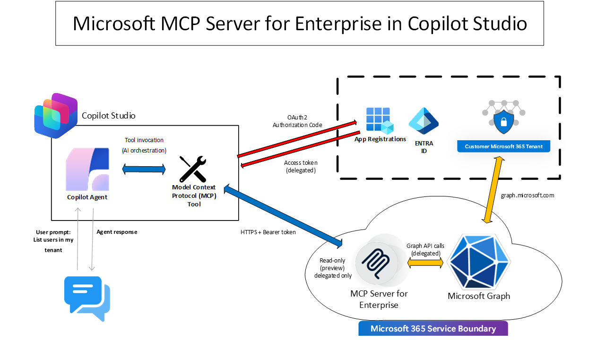


---

## Capabilities and limitations

From the official repo/docs, key points to keep in mind:

- **Delegated permissions only** (user-interactive). App-only permissions / app-only workflows aren’t supported.
- The server is designed for **read-only enterprise IT scenarios** during public preview, focused on Microsoft Entra identity/directory (users, groups, apps, devices, roles, policies, etc.).
- The MCP server is intentionally “atypical”: it exposes **three tools** and generates Microsoft Graph calls via prompting/RAG rather than exposing one tool per Graph operation:
  - `microsoft_graph_suggest_queries`
  - `microsoft_graph_get`
  - `microsoft_graph_list_properties`
- Notes for MCP clients:
  - Dynamic Client Registration (DCR) is not supported (see GitHub repo notes).

---

## Prerequisites

### Roles / permissions
You typically need:
- For tenant provisioning (one-time): **Application Administrator** or **Cloud Application Administrator**
- For app registration: ability to register applications (Application Developer or admin roles)

### Tools
- PowerShell **Run as Administrator**
- PowerShell module: `Microsoft.Entra.Beta` (v1.0.13+)

### You should have ready
- Tenant ID (GUID)
- Ability to create app registrations in Entra ID

---

## Configuration values

You will use these values multiple times:

- `TENANT_ID` — your Entra tenant ID (GUID)
- `CLIENT_ID` — Application (client) ID of your app registration
- `CLIENT_SECRET` — client secret *value* (copy it at creation time)
- MCP Server URL: `https://mcp.svc.cloud.microsoft/enterprise`
- MCP Server (appId): `e8c77dc2-69b3-43f4-bc51-3213c9d915b4`
- Authorization URL template: `https://login.microsoftonline.com/<TENANT_ID>/oauth2/v2.0/authorize`
- Token URL template: `https://login.microsoftonline.com/<TENANT_ID>/oauth2/v2.0/token`
- Quick scope (broad): `e8c77dc2-69b3-43f4-bc51-3213c9d915b4/.default`

> Tip: Create a `.env.example` file if you want to standardize these values for your team.

---

## 1. Provision the MCP Server for Enterprise (one-time per tenant)

Open **PowerShell as Administrator**.

### 1.1 Avoid PowerShell module conflicts

The GitHub quick start notes potential conflicts with Microsoft Graph PowerShell SDK modules. If you run into issues with module conflicts, consider removing Graph modules before continuing:

```powershell
Install-Module Uninstall-Graph
Uninstall-Graph -All
```

> If you don’t have issues, you can skip this step.

### 1.2 Install and connect

Install the required module:

```powershell
Install-Module Microsoft.Entra.Beta -Force -AllowClobber
```

Authenticate to the tenant where you want to register the MCP Server (admin role required):

```powershell
Connect-Entra -Scopes 'Application.ReadWrite.All', 'Directory.Read.All', 'DelegatedPermissionGrant.ReadWrite.All'
```

Recommended sanity-check after auth:

```powershell
Get-EntraContext
```

### 1.3 Register the MCP server

Register Microsoft MCP Server for Enterprise in your tenant and grant permissions to Visual Studio Code:

```powershell
Grant-EntraBetaMCPServerPermission -ApplicationName VisualStudioCode
```

✅ At this point, tenant provisioning is complete.

### 1.4 Confirm registration and permissions (recommended)

**Confirm the service principals exist**

Microsoft Learn provides two appIds you should see after provisioning:

- Microsoft MCP Server for Enterprise: `e8c77dc2-69b3-43f4-bc51-3213c9d915b4`
- Visual Studio Code: `aebc6443-996d-45c2-90f0-388ff96faa56`

Using Microsoft Graph (example):

```http
GET https://graph.microsoft.com/v1.0/servicePrincipals?$select=id,appId,displayName&$filter=appId in('e8c77dc2-69b3-43f4-bc51-3213c9d915b4','aebc6443-996d-45c2-90f0-388ff96faa56')
```

Using Entra PowerShell:

```powershell
$mcpClientSp = Get-EntraBetaServicePrincipal -Select id,appId,displayName -Filter "appId eq 'aebc6443-996d-45c2-90f0-388ff96faa56'"
$mcpServerSp = Get-EntraBetaServicePrincipal -Select id,appId,displayName -Filter "appId eq 'e8c77dc2-69b3-43f4-bc51-3213c9d915b4'"
$mcpClientSp, $mcpServerSp | Format-Table id, appId, displayName -AutoSize
```

**Confirm permissions granted to your MCP clients**

Graph example:

```http
GET https://graph.microsoft.com/v1.0/oauth2PermissionGrants?$select=id,clientId,resourceId,scope&$filter=clientId eq '{mcp-client-servicePrincipal}' and resourceId eq '{mcp-server-servicePrincipal}'
```

PowerShell example:

```powershell
$grant = Get-EntraBetaServicePrincipalOAuth2PermissionGrant -ServicePrincipalId $mcpClientSp.Id
$grant.Scope -split ' '
```
```
---

## 2. Register an application in Microsoft Entra ID

1. Sign in to the **Microsoft Entra admin center**
2. Navigate to: **Entra ID > App registrations > New registration**
3. Enter a name (example: `Copilot-MCP-Server`)
4. Suggested:
   - **Single tenant**
   - Add platform/redirect URI later (after Copilot Studio generates it)
5. Click **Register**
6. Save:
   - **Application (client) ID**
   - **Directory (tenant) ID**

---

## 3. Configure the registered application

### 3.1 Create a client secret

1. Go to: **Certificates & secrets > Client secrets > New client secret**
2. Add a description, set expiration, click **Add**
3. Copy the **client secret value** immediately (you won’t be able to see it again)


### 3.2 Configure permissions/scopes

Least privilege (recommended for enterprise)
Microsoft Learn describes MCP scopes that map to Graph scopes.

1. Go to **API permissions** > **Add a permission** > **APIs my organization uses.**
2. Search for **'Microsoft MCP Server for Enterprise'** and select it.


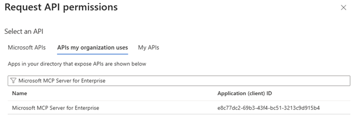

4. Expand all permissions and check all boxes.


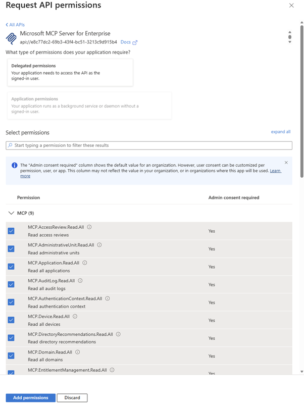

```

## 4. Set up the MCP tool in Copilot Studio

1. Sign in to **Copilot Studio**
2. Create a **new agent**
3. Add a tool and choose **Model Context Protocol**

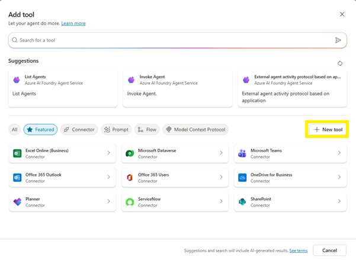

---

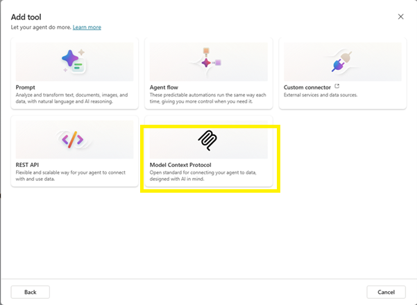


4. Fill in the configuration below

### MCP tool configuration

- **Server Name:** `MS MCP Server Enterprise` (example)
- **Server URL:**  
  `https://mcp.svc.cloud.microsoft/enterprise`
- **Authentication:** `OAuth 2.0 (Manual)`
- **Client ID:** your Entra **Application (client) ID**
- **Client Secret:** your Entra **client secret value**
- **Authorization URL:**  
  `https://login.microsoftonline.com/<TENANT_ID>/oauth2/v2.0/authorize`
- **Token URL:**  
  `https://login.microsoftonline.com/<TENANT_ID>/oauth2/v2.0/token`
- **Scopes (quick start):**  
  `e8c77dc2-69b3-43f4-bc51-3213c9d915b4/.default`

---

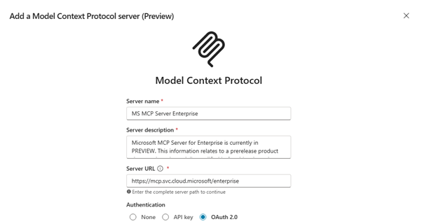

---

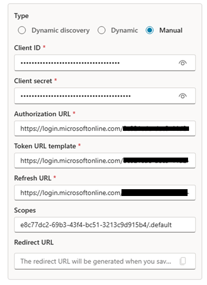

5. Click **Create**
6. **Copy the Redirect URL and wait before clicking Next**

---
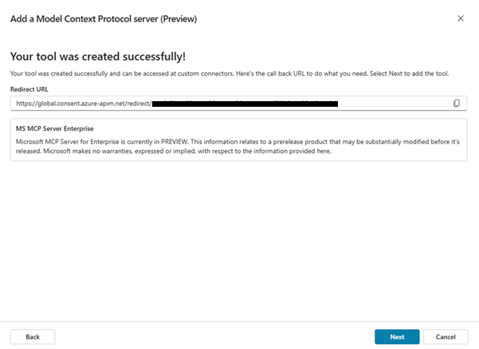

---

## 5. Add the Redirect URI in Entra ID

1. In **Entra admin center**, go to **App registrations > your app**
2. Add the **Redirect URI** copied from Copilot Studio
3. Enable:
   - ✅ **Access tokens**
   - ✅ **ID tokens**

---

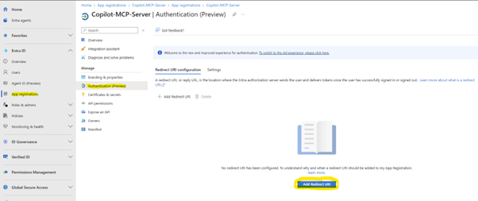

---

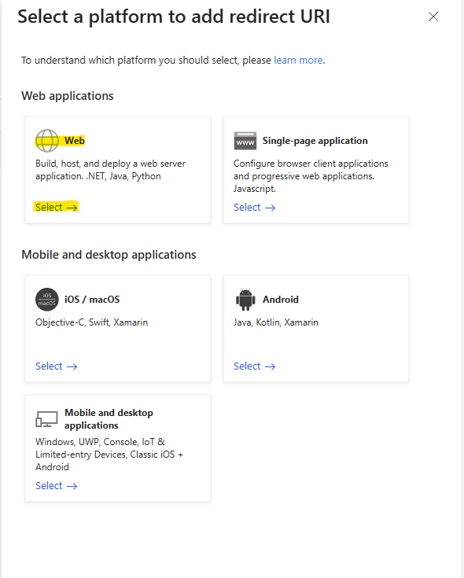

---

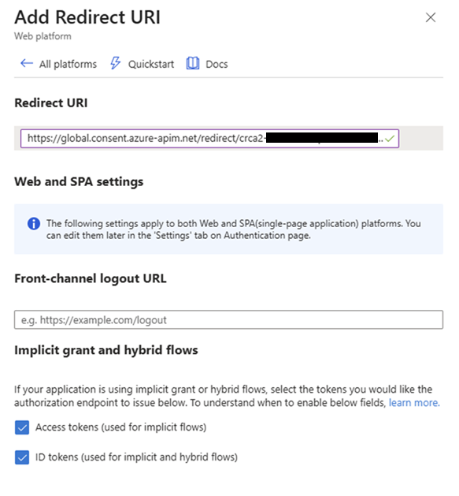

---


## 6. Finalize the connection

1. Return to **Copilot Studio**

---

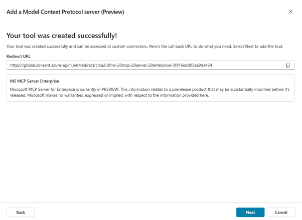

---

2. Complete the connection flow

---
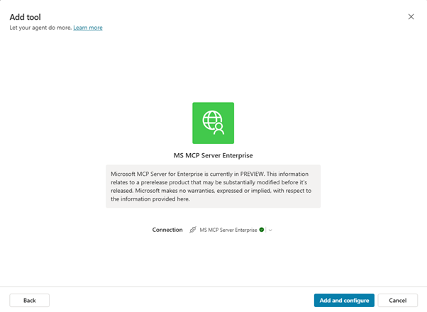

---


---


---


If everything is correct, the tool should be available in the agent.

---

## 7. Test the integration

In Copilot Studio chat, try:

```text
get my tenant detailed information.
```

---

## Troubleshooting

### If you see errors after setup (reconnect via Power Automate)

If you hit connection/consent errors:

1. In Copilot Studio, go to **Tools** (left menu)
2. Click your MCP tool to open its related connector details
3. Go to the **Power Automate custom connector** page (by clicking your connector)
4. Select the **connection** shortcut from the left menu
5. Find your connection, then select:
   - **Reconnect**
   - **Allow Access**
6. Return to Copilot Studio and select your tool again


### Common causes checklist

- Tenant ID mismatch in URLs:
  - `.../<TENANT_ID>/oauth2/v2.0/authorize`
  - `.../<TENANT_ID>/oauth2/v2.0/token`
- Redirect URI not copied correctly or added to the wrong app registration
- Access tokens / ID tokens not enabled
- Missing MCP scopes / admin consent (depending on tenant policy)
- Wrong client secret value (or secret expired)
- Connection cache: needs refresh/reconnect in the connection manager

---

## Monitoring, limits, and auditability

Highlights from the official repo:

- Requests are limited to **100 requests per minute per user** (and Graph throttling still applies).
- Operations are auditable because they execute under a known AppId. You can filter logs by MCP Server appId:  
  `e8c77dc2-69b3-43f4-bc51-3213c9d915b4`

Example Kusto query shown in the repo (adjust time range as needed):

```kusto
MicrosoftGraphActivityLogs
| where TimeGenerated >= ago(30d)
| where AppId == "e8c77dc2-69b3-43f4-bc51-3213c9d915b4"
| project RequestId, TimeGenerated, UserId, RequestMethod, RequestUri, ResponseStatusCode
```

---

## Disable the MCP Server for Enterprise (optional)

Microsoft Learn notes you can’t delete the Microsoft-owned service from your tenant, but you **can disable it** if needed by setting the service principal’s `accountEnabled` to `false`.

Graph example:

```http
PATCH https://graph.microsoft.com/v1.0/servicePrincipals(appId='e8c77dc2-69b3-43f4-bc51-3213c9d915b4')
{
  "accountEnabled": false
}
```

PowerShell example:

```powershell
$mcpServerSp = Get-EntraBetaServicePrincipal -Select id,appId,displayName -Filter "appId eq 'e8c77dc2-69b3-43f4-bc51-3213c9d915b4'"
Set-EntraBetaServicePrincipal -ServicePrincipalId $mcpServerSp.Id -AccountEnabled $false
```

---

## Security notes

- Store secrets in a secure vault (do not commit secrets to Git)
- Rotate secrets regularly and document ownership
- Prefer least-privilege permissions when moving from POC → production

---

## Changelog

- `v1.0` — Initial published guide

---

## Disclaimer

This is community documentation intended to help reproduce a working configuration.
It is not official Microsoft documentation.
